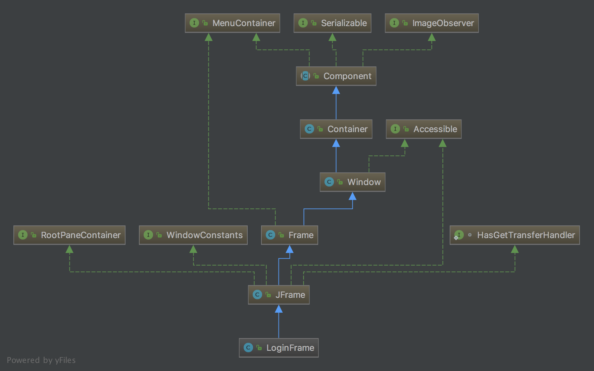
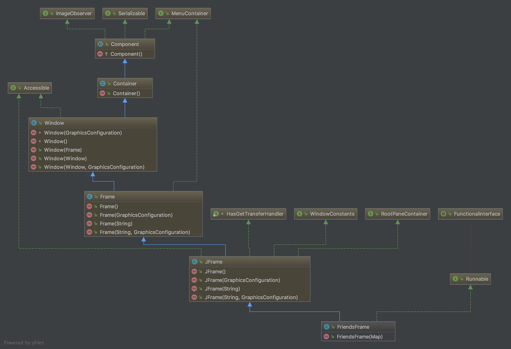

# 项目实战2：开发 Java 版 QQ2006 聊天工具

上一章开发的 PetStore 宠物商店项目没涉及到多线程和网络通信，本章介绍的 QQ2006 聊天工具会涉及到这方面的技术。本章介绍 JavaSE 技术实现的 QQ2006 聊天工具项目，所涉及到的知识点：Java 面向对象、Lambda 表达式、JavaSwing 技术、多线程技术和网络通信等知识，其中还会用到方方面面的 Java 基础知识。

## 1 系统分析与设计

本节对 QQ2006 聊天工具项目分析和设计，其中设计过程包括原型设计、数据库设计和系统设计。

### 1.1 项目概述

QQ2006 是一个网络即时聊天工具，即时聊天工具可以在两名或多名用户之间传递即时消息的网络软件，**大部分的即时聊天软件都可以显示联络人名单，并能显示联络人是否在线**，聊天者发出的每一句话都会显示在双方的屏幕上。即时聊天工具主要有：

- ICQ：最早的网络即时通讯工具。1996年，三个以色列人维斯格、瓦迪和高德芬格一起开发了 ICQ 工具。ICQ 支持在 Internet 上聊天、发送消息和文件等。

- Tecent QQ：国内最流行的即时通讯工具。

- MSN Messenger：是微软所开发，曾经在公司中使用广泛。

- 百度Hi：百度公司推出的一款集文字消息、音视频通话、文件传输等功能的失败即时通讯软件。

- 阿里旺旺：是阿里巴巴公司为自己旗下产品用户定制的商务沟通软件。

- Gtalk：Google 的即时通讯工具。

- Skype：该软件由 Dane、Janus Friis、Swede 联合编写软件后台的爱沙尼亚人 Ahti Heinla、Priit Kasesalu 和 Jaan Tallinn 共同发布。Skype所 采用的后台也被音乐分享软件Kazaa 所使用。2005年9月，eBay 以26亿美元的价格购得Skype。

- WeChat：基于移动平台的即时通讯工具。

### 1.2　需求分析

QQ2006 项目工具分为有**客户端**和**服务器端**，客户端和服务器端都提供了很多工作线程，这些线程帮助进行后台通信等处理。客户端有聊天用户和工作线程完成工作，客户端主要功能如下：

- **用户登录**：用户打开登录窗口，单击登录按钮登录。客户端工作线程向服务器发送用户登录请求消息；客户端工作线程接收到服务器返回信息，如果成功界面跳转，是否弹出提示框，提示用户登录失败。
- **打开聊天对话框**：用户双击好友列表中的好友，打开聊天对话框。
- **显示好友列表**：当用户登录成功后，客户端工作线程接收服务器端数据，根据数据显示好友列表。
- **刷新好友列表**：每一个用户上线（登录成功），服务器会广播用户上线消息，客户端工作线程接收到用户上线消息，则将好友列表中好友在线状态更新。
- **向好友发送消息**：用户在聊天对话框中发送消息给好友，服务器端工作线程接收到这个消息后，转发给用户好友。
- **接收好友消息**：客户端工作线程接收好友消息，这个消息是服务器转发的。
- **用户注销**：单击好友列表的关闭窗口，则用户下线。客户端工作线程向服务器发送用户下线消息。

采用用例分析方法描述客户端用例图，如图1-1所示。


服务器端所有功能都是通过服务线程工作线程完成的，没有人为操作，服务器端主要功能如下：

- **客户用户登录**：客户端用户发生登录请求，服务器端工作线程查询数据库用户信息，验证用户登录。用户登录成功后服务器端工作线将好友信息发送个客户端。
- **广播用户上线消息**：当用户登录成功后，服务器向所有在线用户发送消息，即广播。
- **接收用户消息**：用户在聊天时发送消息给服务器，服务器端工作线程一直不断地接收用户消息。
- **转发消息给好友**：服务器端工作线程接收到用户发送的聊天信息，然后再将消息转发给好友。

采用用例分析方法描述服务器端用例图，如图1-2所示。


### 1.3 原型设计

服务器端没有界面，没有原型设计。客户端有原型设计，原型设计主要应用于图形界面应用程序，原型设计对于设计人员、开发人员、测试人员、UI 设计人员以及用户都是非常重要的。QQ2006 项目客户端原型设计图如图1-3所示。


### 1.4 数据库设计

数据库设计模型中各个表说明如下：

#### 01 用户表

用户表（英文名 user）是 QQ2006 的注册用户，用户 Id（英文名user_id）是主键，用户表结构如表1-1所示。

##### 表1-1 用户表

| 字段名    | 数据类型     | 长度 | 精度 | 主键 | 外键 | 备注     |
| --------- | ------------ | ---- | ---- | ---- | ---- | -------- |
| user_id   | VARCHAR(80)  | 80   | -    | T    | N    | 用户ID   |
| user_pwd  | VARCHAR(25)  | 25   | -    | N    | N    | 用户密码 |
| user_name | VARCHAR(80)  | 80   | -    | N    | N    | 用户名   |
| user_icon | VARCHAR(100) | 100  | -    | N    | N    | 用户头像 |

用户好友表用户好友表（英文名 friend）只有两个字段用户 Id1 和用户 Id2，它们是用户好友的联合主键，给定一个用户Id1和用户Id2
可以确定用户好友表中唯一一条数据，这是「主键约束」。用户好友表与用户表关系比较复杂，用户好友表的两个字段都引用到用户表用户 
Id 字段，用户好友表中的用户 Id1 和用户 Id2 都是必须是用户表中存在的用户 Id，这是「外键约束」，用户好友表结构如表1-2所示。

##### 表1-2 用户好友表

| 字段名   | 数据类型    | 长度 | 精度 | 主键 | 外键 | 备注    |
| -------- | ----------- | ---- | ---- | ---- | ---- | ------- |
| user_id1 | VARCHAR(80) | 80   | -    | T    | T    | 用户ID1 |
| user_id2 | VARCHAR(80) | 80   | -    | T    | T    | 用户ID2 |

对于初学者理解用户好友表与用户表的关系有一定的困难，下面通过如图1-5所示进一步理解它们之间的关系。从图中可见用户好友表中的 user_id1 和 user_id2 数据都是用户表 user_id 存在的。


那么用户111的好友应该有222、333和888，凡是好友表中 user_id1 或 user_id2 等于111的数据都是其好友。要想通过一条 SQL 语句查询出用户111的好友信息，可以多种写法，主要使用表连接或子查询实现，如下代码是笔者通过子查询实现 SQL 语句：

```sql
SELECT
    user_id,
    user_pwd,
    user_name,
    user_icon
FROM `user`
WHERE user_id IN (
    SELECT user_id2 AS user_id
    FROM friend
    WHERE user_id1 = 111
)
      OR user_id IN (
    SELECT user_id1 AS user_id
    FROM friend
    WHERE user_id2 = 111
);
```

其中 `select user_id2 as user_id from friend where user_id1 = 111` 和 `select user_id1 as user_id from friend where user_id2 = 111` 是两个子查询，分别查询出好友表中 `user_id1 = 111` 的 `user_id2` 的数据和 `user_id2 = 111` 的 `user_id1` 的数据。在 MySQL 数据库执行 SQL 语句，结果如图1-6所示。


### 1.5 网络拓扑图

QQ2006 项目分为客户端和服务器，采用 C/S（客户端/服务器）网络结构，如图1-7所示，服务器只有一个，客户端可以有多个。


### 1.6 系统设计

系统设计也分为客户端和服务器端。

#### 01 客户端系统设计

如图1-8所示，客户端有很多三个窗口：用户登录窗口 `LoginFrame`、好友列表窗口 `FriendsFrame` 和聊天窗口 `ChatFrame`，其中 `CartFrame` 与 `FriendsFrame` 关联关系。`Client` 是客户端启动类。


#### 02 服务器端系统设计

服务器系统设计如图1-9所示，服务器端没有图像用户界面，服务器端4个类说明如下：

- Server：服务器端启动类。
- UserDAO：服务器端用户信息 DAO 类，用来操作数据库用户表。
- DBHelper：连接数据库辅助类。
- ClientInfo：服务器端保存客户端信息类，userId 属性是客户Id、address 属性客户端地址、port 是客户端端口号。


## 2 任务1：创建服务器数据库

在设计完成之后，在编写 Java 代码之前，应该先创建服务器端数据库。

### 2.1 迭代1.1：安装和配置 MySQL 数据库

首先应该为开发该项目，准备好数据库。本书推荐使用 MySQL 数据库，如果没有安装 MySQL 数据库，可以参考28.2.1节安装 MySQL 数据库。

### 2.2 迭代1.2：编写数据库 DDL 脚本

按照图30-4所示的数据库设计模型编写数据库 DDL 脚本。当然，也可以通过一些工具生成 DDL 脚本，然后把这个脚本放在数据库中执行就可以了。下面是编写的 DDL 脚本：

```sql
CREATE DATABASE IF NOT EXISTS TencentQQ;

USE TencentQQ;

/* 用户表 */
CREATE TABLE IF NOT EXISTS `user` (
    user_id VARCHAR(80) NOT NULL, /* 用户Id  */
    user_pwd VARCHAR(25) NOT NULL, /* 用户密码 */
    user_name VARCHAR(80) NOT NULL, /* 用户名 */
    user_icon VARCHAR(100) NOT NULL, /* 用户头像 */
    PRIMARY KEY (user_id)
);


/* 用户好友表Id1和Id2互为好友 */
CREATE TABLE IF NOT EXISTS `friend` (
    user_id1 VARCHAR(80) NOT NULL, /* 用户Id1  */
    user_id2 VARCHAR(80) NOT NULL, /* 用户Id2  */
    PRIMARY KEY (user_id1, user_id2)
);
```

如果读者对于编写 DDL 脚本不熟悉，可以直接使用笔者编写好的 database.sql  脚本文件，文件位于 QQ2006 项目下 db 目录中。

### 2.3 迭代1.3：插入初始数据到数据库

QQ2006 项目服务器端有一些初始的数据，这些初始数据在创建数据库之后插入。这些插入数据的语句如下：

```sql
INSERT INTO TencentQQ.user (user_id, user_pwd, user_name, user_icon) VALUES ('100141', 'WIQ6dgi', 'Lil Subhan', 'Skimia');
INSERT INTO TencentQQ.user (user_id, user_pwd, user_name, user_icon) VALUES ('100376', 'PX1dG4VJPYn', 'Sharona Copcott', 'Agimba');
...
INSERT INTO TencentQQ.friend (user_id1, user_id2) VALUES ('100053', '876756');
INSERT INTO TencentQQ.friend (user_id1, user_id2) VALUES ('100267', '895611');
...
```

## 3 任务2：应用并初始化项目

本项目推荐使用 IDEA 工具，所以首先参考3.1节创建一个 IDEA 项目，项目名称 TencentQQ。

### 3.1 任务2.1：配置项目构建路径

QQ2006 项目创建完成后，需要参考如图3-10所示，在 QQ2006 项目根目录下面创建普通文件夹 db。然后将 MySQL 数据库 JDBC 驱动程序 `mysql-connector-java-5.xxx-bin.jar` 拷贝到 db 目录，参考28.3.2节将驱动程序文件添加到项目的构建路径中。`resource/img` 文件夹中内容是项目使用的图片。

```powershell
.
├── db
├── img
└── src
    ├── com
    │   └── lightwing
    │       └── qq
    │           ├── client
    │           └── server
    ├── lib
    ├── org
    │   └── json
    └── resource
        └── img
```

### 3.2　任务2.2：添加资源图片

项目中会用到很多资源图片，为了打包发布项目方便，这些图片最好放到 src 源文件夹下，IDEA 会将该文件夹下有文件一起复制到字节码文件夹中。参考图30-10在 src 文件夹下创建resource/img 文件夹，然后将本书配套资源中找到 images 中的图片，并复制到 IDEA 项目的 resource/img 文件夹中。

### 3.3 任务2.3：添加 JSON-java 库

客户端与服务器之间数据交换采用 JSON 格式，JSON 解码和编码库采用第三方的 JSON-java 库，参考24.4.2节添加 JSON-java 库到项目。

### 3.4 任务2.4：添加包

参考图3-10在 src 文件夹中创建如下3个包：

- com.lightwing.qq.client。放置客户端组件。
- com.lightwing.qq.server。放置服务器端组件。
- org.json。放置 JSON-java 库类。

## 4　任务3：编写服务器端外围代码

服务器端外围代码主要是涉及到 UserDAO、DBHelper 和 ClientInfo 等几个非通信类。

### 4.1 任务3.1：编写 UserDAO 类

UserDAO 是操作数据库用户表的 DAO 对象，如图4-11所示是  UserDAO 详细类图。它有三个公有查询方法：

```java
public List<Map<String, String>> findAll()
public Map<String, String> findById(String id)
public List<Map<String, String>> findFriends(String id)
```

通过用户 ID 查询用户信息，查询返回的数据在 Map 中，没有放到实体类中。findFriends 是通过用户 ID 查询他的所有好友，返回的是 List 集合，其中的每一个元素都是 Map。


UserDAO 代码如下：

```java
package com.lightwing.qq.server;

import java.sql.Connection;
import java.sql.PreparedStatement;
import java.sql.ResultSet;
import java.sql.SQLException;
import java.util.ArrayList;
import java.util.HashMap;
import java.util.List;
import java.util.Map;

class UserDAO {
    // 查询所有用户信息
    List<Map<String, String>> findAll() {
        List<Map<String, String>> list = new ArrayList<>();
        // SQL 语句
        String sql = "SELECT " +
                "`user_id`, `user_pwd`, `user_name`, `user_icon` " +
                "FROM `user` " +
                "WHERE `user_id`";
        try (// 2.创建数据库连接
             Connection conn = DBHelper.getConnection();
             // 3. 创建语句对象
             PreparedStatement pstmt = conn.prepareStatement(sql);
             // 5. 执行查询
             ResultSet rs = pstmt.executeQuery();) {
            // 6. 遍历结果集
            while (rs.next()) {
                Map<String, String> row = new HashMap<String, String>();
                row.put("user_id", rs.getString("user_id")); ①
                row.put("user_name", rs.getString("user_name"));
                row.put("user_pwd", rs.getString("user_pwd"));
                row.put("user_icon", rs.getString("user_icon")); ②

                list.add(row);
            }

        } catch (SQLException ignored) {
        }
        return list;
    }

    // 按照主键查询
    Map<String, String> findById(String id) {
        Connection conn = null;
        PreparedStatement pstmt = null;
        ResultSet rs = null;
        // SQL语句
        String sql = "SELECT " +
                "`user_id`, `user_pwd`, `user_name`, `user_icon` " +
                "FROM " +
                "`user` " +
                "WHERE `user_id` = ?";
        try {
            // 2.创建数据库连接
            conn = DBHelper.getConnection();
            // 3. 创建语句对象

            pstmt = conn.prepareStatement(sql);
            // 4. 绑定参数
            pstmt.setString(1, id);
            // 5. 执行查询（R）
            rs = pstmt.executeQuery();
            // 6. 遍历结果集
            if (rs.next()) {
                Map<String, String> row = new HashMap<>();
                row.put("user_id", rs.getString("user_id")); ③
                row.put("user_name", rs.getString("user_name"));
                row.put("user_pwd", rs.getString("user_pwd"));
                row.put("user_icon", rs.getString("user_icon")); ④

                return row;
            }

        } catch (SQLException ignored) {
        } finally {
            if (rs != null) {
                try {
                    rs.close();
                } catch (SQLException ignored) {
                }
            }
            if (pstmt != null) {
                try {
                    pstmt.close();
                } catch (SQLException ignored) {
                }
            }
            if (conn != null) {
                try {
                    conn.close();
                } catch (SQLException ignored) {
                }
            }
        }
        return null;
    }

    // 查询好友列表
    List<Map<String, String>> findFriends(String id) {
        Connection conn = null;
        PreparedStatement pstmt = null;
        ResultSet rs = null;
        List<Map<String, String>> friends = new ArrayList<>();
        // SQL语句
        String sql = "SELECT " +
                "`user_id`, `user_pwd`, `user_name`, `user_icon` " +
                "FROM " +
                "`user` " +
                "WHERE " +
                "`user_id` IN (" +
                "SELECT `user_id2` AS `user_id` " +
                "FROM `friend` WHERE `user_id1` = ?)"
                + " OR `user_id` IN (" +
                "SELECT `user_id1` AS `user_id`  FROM `friend` WHERE `user_id2` = ?)"; ⑤
        try {
            // 2.创建数据库连接
            conn = DBHelper.getConnection();
            // 3. 创建语句对象

            pstmt = conn.prepareStatement(sql);
            // 4. 绑定参数
            pstmt.setString(1, id);
            pstmt.setString(2, id);
            // 5. 执行查询（R）
            rs = pstmt.executeQuery();
            // 6. 遍历结果集
            while (rs.next()) {
                Map<String, String> row = new HashMap<String, String>();
                row.put("user_id", rs.getString("user_id")); ⑥
                row.put("user_name", rs.getString("user_name"));
                row.put("user_pwd", rs.getString("user_pwd"));
                row.put("user_icon", rs.getString("user_icon")); ⑦

                friends.add(row);
            }
        } catch (SQLException ignored) {
        } finally {
            if (rs != null) {
                try {
                    rs.close();
                } catch (SQLException ignored) {
                }
            }
            if (pstmt != null) {
                try {
                    pstmt.close();
                } catch (SQLException ignored) {
                }
            }
            if (conn != null) {
                try {
                    conn.close();
                } catch (SQLException ignored) {
                }
            }
        }
        return friends;
    }
}
```

在 `findAll()` 方法中代码第①行~第②行遍历结果集，并将数据从字段中取出，然后按照键值对放入到 Map 对象中。findById 方法中代码第③行~第④行，findFriends 方法中代码第⑥行~第⑦行的处理也是类似的。代码第⑤行 SQL 语句使用了子查询，在前面数据库设计时已经介绍了这里不再赘述。

### 4.2 迭代3.2：数据库帮助类 DBHelper

数据库帮助类 DBHelper 可以进行 JDBC 驱动程序加载以及获得数据库连接。如图4-12所示是 DBHelper 详细类图。它有两个静态变量和一个静态方法。


DBHelper 具体实现代码如下：

```java
package com.lightwing.qq.server;

import java.io.IOException;
import java.io.InputStream;
import java.sql.Connection;
import java.sql.DriverManager;
import java.sql.SQLException;
import java.util.Properties;

public class DBHelper {
    // 连接数据库 url
    private static String url;
    // 创建 Properties 对象
    private static Properties info = new Properties();

    // 1.驱动程序加载
    static {
        // 获得属性文件输入流
        InputStream input = DBHelper.class.getClassLoader()
                .getResourceAsStream("com/lightwing/qq/server/config.properties");

        try {
            // 加载属性文件内容到 Properties 对象
            info.load(input);
            // 从属性文件中取出url
            url = info.getProperty("url"); ①
            // 从属性文件中取出 driver
            String driverClassName = info.getProperty("driver");
            Class.forName(driverClassName);
            System.out.println("驱动程序加载成功...");
        } catch (ClassNotFoundException e) {
            System.out.println("驱动程序加载失败...");
        } catch (IOException e) {
            System.out.println("加载属性文件失败...");
        }
    } ②

    public static Connection getConnection() throws SQLException { 
        // 创建数据库连接
        Connection conn = DriverManager.getConnection(url, info);
        return conn; ③
    }
}
```

上述代码第①行~第②行通过静态代码库加载数据库驱动程序，并且在静态代码块中读取配置文件 config.properties 信息，该配置文件位于 `com.lightwing.qq.server` 包中，内容如下：

```properties
## this is db config file
driver=com.mysql.jdbc.Driver
url=jdbc:mysql://localhost:3306/TencentQQ
user=root
password=canton0520
useSSL=false
verifyServerCertificate=false
```

代码第③行提供了获得数据库连接方法，这是一个静态方法使用起来比较方便。

### 4.3　任务3.3：编写 ClientInfo 类

一个用户可以在任何一个客户端主机上登录，因此登录的客户端主机 IP 和端口号都是动态的。为了在服务器端保存所有登录的用户 ID，以及登录的客户端主机地址和端口号信息，所以设计了 ClientInfo 类。如图4-13所示是 ClientInfo 详细类图。


```java
package com.lightwing.qq.server;

import java.net.InetAddress;

public class ClientInfo {
    // 用户 ID
    private String userId;
    // 客户端 IP 地址
    private InetAddress address;
    // 客户端端口号
    private int port;

    String getUserId() {
        return userId;
    }

    void setUserId(String userId) {
        this.userId = userId;
    }

    InetAddress getAddress() {
        return address;
    }

    void setAddress(InetAddress address) {
        this.address = address;
    }

    public int getPort() {
        return port;
    }

    public void setPort(int port) {
        this.port = port;
    }
}
```

注意为了方便客户端 IP 地址属性的类型是 InetAddress，不是字符串。

## 5 任务4：客户端 UI 实现

从客观上讲，客户端 UI 实现开发的工作量是很大的，有很多细节工作需要完成。

### 5.1 迭代4.1：登录窗口实现

客户端启动马上显示用户登录窗口，界面如图5-14所示，界面中有很多组件，但是本例中主要使用文本框、密码框和两个按钮。等用户输入 QQ 号码和 QQ 密码，单击「登录」按钮，如果输入的账号和密码正确，则登录成功进入好友列表窗口；如果输入的不正确，则弹出如图5-15所示的对话框。


登录窗口类是 LoginFrame，它的类图如图5-16所示。



用户登录窗口 LoginFrame 代码如下：

```java
package com.lightwing.qq.client;

import org.json.JSONObject;

import javax.swing.*;
import java.awt.*;
import java.awt.event.WindowAdapter;
import java.awt.event.WindowEvent;
import java.io.IOException;
import java.net.DatagramPacket;
import java.net.InetAddress;
import java.util.Map;

public class LoginFrame extends JFrame {
    // QQ号码文本框
    private JTextField txtUserId = null;
    // QQ密码框
    private JPasswordField txtUserPwd = null;

    public LoginFrame() {
        JLabel lblImage = new JLabel();
        lblImage.setIcon(new ImageIcon(LoginFrame.class.getResource("/resource/img/QQll.JPG")));
        lblImage.setBounds(0, 0, 325, 48);
        getContentPane().add(lblImage);

        // 添加蓝线面板
        getContentPane().add(getPaneLine());

        // 初始化登录按钮
        JButton btnLogin = new JButton();
        btnLogin.setBounds(152, 181, 63, 19);
        btnLogin.setFont(new Font("Dialog", Font.PLAIN, 12));
        btnLogin.setText("登录");
        getContentPane().add(btnLogin);
        // 注册登录按钮事件监听器
        btnLogin.addActionListener(e -> {
            // 先进行用户输入验证，验证通过再登录
            String userId = txtUserId.getText();
            String password = new String(txtUserPwd.getPassword());

            Map user = login(userId, password);
            if (user != null) {
                // 登录成功调转界面
                System.out.println("登录成功调转界面");
                // 设置登录窗口可见
                this.setVisible(false);
                FriendsFrame frame = new FriendsFrame(user);
                frame.setVisible(true);
            } else {
                JOptionPane.showMessageDialog(null, "您QQ号码或密码不正确");
            }
        });

        // 初始化取消按钮
        JButton btnCancel = new JButton();
        btnCancel.setBounds(233, 181, 63, 19);
        btnCancel.setFont(new Font("Dialog", Font.PLAIN, 12));
        btnCancel.setText("取消");
        getContentPane().add(btnCancel);
        btnCancel.addActionListener(e -> {
            // 退出系统
            System.exit(0);
        });

        // 初始化【申请号码↓】按钮
        JButton btnSetup = new JButton();
        btnSetup.setBounds(14, 179, 99, 22);
        btnSetup.setFont(new Font("Dialog", Font.PLAIN, 12));
        btnSetup.setText("申请号码↓");
        getContentPane().add(btnSetup);

        /// 初始化当前窗口
        setIconImage(Toolkit.getDefaultToolkit().getImage(Client.class.getResource("/resource/img/QQ.png")));
        setTitle("QQ登录");
        setResizable(false);
        getContentPane().setLayout(null);
        // 设置窗口大小
        int frameWidth = 329;
        // 登录窗口宽高
        int frameHeight = 250;
        setSize(frameWidth, frameHeight);
        // 计算窗口位于屏幕中心的坐标
        // 获得当前屏幕的宽高
        double screenWidth = Toolkit.getDefaultToolkit().getScreenSize().getWidth(); ①
        int x = (int) (screenWidth - frameWidth) / 2;
        double screenHeight = Toolkit.getDefaultToolkit().getScreenSize().getHeight(); ②
        int y = (int) (screenHeight - frameHeight) / 2;
        // 设置窗口位于屏幕中心
        setLocation(x, y);

        // 注册窗口事件
        addWindowListener(new WindowAdapter() {
            // 单击窗口关闭按钮时调用
            public void windowClosing(WindowEvent e) {
                // 退出系统
                System.exit(0);
            }
        });
    }

    // 客户端向服务器发送登录请求
    private Map login(String userId, String password) {
        // 准备一个缓冲区
        byte[] buffer = new byte[1024];
        InetAddress address;
        try {
            address = InetAddress.getByName(Client.SERVER_IP);
            JSONObject jsonObj = new JSONObject();
            jsonObj.put("command", Client.COMMAND_LOGIN);
            jsonObj.put("user_id", userId);
            jsonObj.put("user_pwd", password);
            // 字节数组
            byte[] b = jsonObj.toString().getBytes();
            // 创建DatagramPacket对象
            DatagramPacket packet = new DatagramPacket(b, b.length, address, Client.SERVER_PORT);
            // 发送
            Client.socket.send(packet);

            // 接收数据报
            packet = new DatagramPacket(buffer, buffer.length, address, Client.SERVER_PORT);
            Client.socket.receive(packet);
            // 接收数据长度
            int len = packet.getLength();
            String str = new String(buffer, 0, len);
            System.out.println("receivedjsonObj = " + str);
            JSONObject receivedjsonObj = new JSONObject(str);

            if ((Integer) receivedjsonObj.get("result") == 0) {
                Map user = receivedjsonObj.toMap();
                return user;
            }

        } catch (IOException e) {
            e.printStackTrace();
        }
        return null;
    }

    // 蓝线面板
    private JPanel getPaneLine() {
        JPanel paneLine = new JPanel();
        paneLine.setLayout(null);
        paneLine.setBounds(7, 54, 308, 118);
        // 边框颜色设置为蓝色
        paneLine.setBorder(BorderFactory.createLineBorder(new Color(102, 153, 255), 1));

        // 初始化「忘记密码？」标签
        JLabel lblHelp = new JLabel();
        lblHelp.setBounds(227, 47, 67, 21);
        lblHelp.setFont(new Font("Dialog", Font.PLAIN, 12));
        lblHelp.setForeground(new Color(51, 51, 255));
        lblHelp.setText("忘记密码？");
        paneLine.add(lblHelp);

        // 初始化「QQ密码」标签
        JLabel lblUserPwd = new JLabel();
        lblUserPwd.setText("QQ密码");
        lblUserPwd.setFont(new Font("Dialog", Font.PLAIN, 12));
        lblUserPwd.setBounds(21, 48, 54, 18);
        paneLine.add(lblUserPwd);

        // 初始化「QQ号码↓」标签
        JLabel lblUserId = new JLabel();
        lblUserId.setText("QQ号码↓");
        lblUserId.setFont(new Font("Dialog", Font.PLAIN, 12));
        lblUserId.setBounds(21, 14, 55, 18);
        paneLine.add(lblUserId);

        // 初始化「QQ号码」文本框
        this.txtUserId = new JTextField();
        this.txtUserId.setBounds(84, 14, 132, 18);
        paneLine.add(this.txtUserId);

        // 初始化「QQ密码」密码框
        this.txtUserPwd = new JPasswordField();
        this.txtUserPwd.setBounds(84, 48, 132, 18);
        paneLine.add(this.txtUserPwd);

        // 初始化「自动登录」复选框
        JCheckBox chbAutoLogin = new JCheckBox();
        chbAutoLogin.setText("自动登录");
        chbAutoLogin.setFont(new Font("Dialog", Font.PLAIN, 12));
        chbAutoLogin.setBounds(79, 77, 73, 19);
        paneLine.add(chbAutoLogin);

        // 初始化「隐身登录」复选框
        JCheckBox chbHideLogin = new JCheckBox();
        chbHideLogin.setText("隐身登录");
        chbHideLogin.setFont(new Font("Dialog", Font.PLAIN, 12));
        chbHideLogin.setBounds(155, 77, 73, 19);
        paneLine.add(chbHideLogin);

        return paneLine;
    }
}
```

上述代码第①行和第②行是获取当前屏幕的宽和高，用来介绍当前窗口屏幕居中的坐标。具体的原理在25.5.7节已经介绍过程，这里不再赘述。代码第③行是用户单击登录按钮之后的处理，本节暂时不介绍具体实现过程，后面介绍登录处理时在详细说明。代码第④行~第⑤行的初始化登录窗口，包括设置窗口图标，窗口大小和位置等内容。代码第⑥行注册窗口事件，当用户单击窗口的关闭按钮时调用 `System.exit(0)` 语句退出系统。代码第⑦行的 `getPaneLine()` 方法用来初始化「蓝线面板」，蓝线面板如图5-17所示的虚线部分，其中包括：一个文本框、一个密码框、两个复选框和三个标签。


### 5.2 迭代4.2：好友列表窗口实现

在客户端用户登录成功之后，界面会跳转到好友列表窗口，界面如图5-18所示。


好友列表窗口类是 `FriendsFrame`，它的类图如图5-19所示。



好友列表窗口类 `FriendsFrame` 代码如下：

```java
package com.lightwing.qq.client;

import org.json.JSONObject;

import javax.swing.*;
import java.awt.*;
import java.awt.event.MouseAdapter;
import java.awt.event.MouseEvent;
import java.awt.event.WindowAdapter;
import java.awt.event.WindowEvent;
import java.io.IOException;
import java.net.DatagramPacket;
import java.net.InetAddress;
import java.util.ArrayList;
import java.util.List;
import java.util.Map;

public class FriendsFrame extends JFrame implements Runnable {

    // 线程运行状态
    private boolean isRunning = true;
    // 好友标签控件列表
    private List<JLabel> lblFriendList;

    public FriendsFrame(Map user) {
        setTitle("QQ2006");
        // 初始化成员变量
        // 用户信息
        /// 初始化用户列表
        // 好友列表
        List<Map<String, String>> friends = (List<Map<String, String>>) user.get("friends");

        // 设置布局
        BorderLayout borderLayout = (BorderLayout) getContentPane().getLayout();
        borderLayout.setVgap(5);

        String userId = (String) user.get("user_id");
        String userName = (String) user.get("user_name");
        String userIcon = (String) user.get("user_icon");

        JLabel lblLabel = new JLabel(userName);
        lblLabel.setHorizontalAlignment(SwingConstants.CENTER);
        String iconFile = String.format("/resource/img/%s.jpg", userIcon);
        lblLabel.setIcon(new ImageIcon(FriendsFrame.class.getResource(iconFile)));
        getContentPane().add(lblLabel, BorderLayout.NORTH);

        JScrollPane scrollPane = new JScrollPane();
        scrollPane.setBorder(BorderFactory.createLineBorder(Color.blue, 1));

        getContentPane().add(scrollPane, BorderLayout.CENTER);

        JPanel panel1 = new JPanel();
        scrollPane.setViewportView(panel1);
        panel1.setLayout(new BorderLayout(0, 0));

        JLabel label = new JLabel("我的好友");
        label.setHorizontalAlignment(SwingConstants.CENTER);
        panel1.add(label, BorderLayout.NORTH);

        // 好友列表面板
        JPanel friendListPanel = new JPanel();
        panel1.add(friendListPanel);
        friendListPanel.setLayout(new GridLayout(50, 0, 0, 5));

        lblFriendList = new ArrayList<>();
        // 初始化好友列表
        for (Map<String, String> friend : friends) {
            String friendUserId = friend.get("user_id");
            String friendUserName = friend.get("user_name");
            String friendUserIcon = friend.get("user_icon");
            // 获得好友在线状态
            String friendUserOnline = friend.get("online");
            JLabel lblFriend = new JLabel(friendUserName);
            lblFriend.setToolTipText(friendUserId);
            String friendIconFile = String.format("/resource/img/%s.jpg", friendUserIcon);
            lblFriend.setIcon(new ImageIcon(FriendsFrame.class.getClass().getResource(friendIconFile)));
            // 在线设置可用，离线设置不可用
            if (friendUserOnline.equals("0")) {
                lblFriend.setEnabled(false);
            } else {
                lblFriend.setEnabled(true);
            }

            lblFriend.addMouseListener(new MouseAdapter() {
                @Override
                public void mouseClicked(MouseEvent e) {
                    // 用户图标双击鼠标时显示对话框
                    if (e.getClickCount() == 2) {
                        ChatFrame chatFrame = new ChatFrame(FriendsFrame.this, user, friend);
                        chatFrame.setVisible(true);
                        isRunning = false;
                    }
                }
            });
            // 添加到列表集合
            lblFriendList.add(lblFriend);
            // 添加到面板
            friendListPanel.add(lblFriend);
        }

        /// 初始化当前Frame
        setSize(150, 600);
        // 获得当前屏幕的宽
        double screenWidth = Toolkit.getDefaultToolkit().getScreenSize().getWidth();
        // 登录窗口宽高
        int frameWidth = 260;
        int frameHeight = 600;
        setBounds((int) screenWidth - 300, 10, frameWidth, frameHeight);
        setIconImage(Toolkit.getDefaultToolkit().getImage(FriendsFrame.class.getResource("/resource/img/QQ.png")));

        // 注册窗口事件
        addWindowListener(new WindowAdapter() {
            // 单击窗口关闭按钮时调用
            public void windowClosing(WindowEvent e) {
                // 准备一个缓冲区
                byte[] buffer = new byte[0b10000000000];
                // 当前用户下线
                JSONObject jsonObj = new JSONObject();
                jsonObj.put("command", Client.COMMAND_LOGOUT);
                jsonObj.put("user_id", userId);
                byte[] b = jsonObj.toString().getBytes();

                InetAddress address;
                try {
                    address = InetAddress.getByName(Client.SERVER_IP);
                    // 创建DatagramPacket对象
                    DatagramPacket packet = new DatagramPacket(b, b.length, address, Client.SERVER_PORT);
                    // 发送
                    Client.socket.send(packet);
                } catch (IOException ignored) {
                }
                // 退出系统
                System.exit(0);
            }
        });

        // 启动接收消息子线程
        resetThread();
    }

    @Override
    public void run() {
        // 准备一个缓冲区
        byte[] buffer = new byte[1024];
        while (isRunning) {
            try {
                InetAddress address = InetAddress.getByName(Client.SERVER_IP);
                // 接收数据报
                DatagramPacket packet = new DatagramPacket(buffer, buffer.length, address, Client.SERVER_PORT);
                // 开始接收
                Client.socket.receive(packet);
                // 接收数据长度
                int len = packet.getLength();
                String str = new String(buffer, 0, len);
                System.out.println("客户端：  " + str);
                JSONObject jsonObj = new JSONObject(str);
                String userId = (String) jsonObj.get("user_id");
                String online = (String) jsonObj.get("online");

                // 刷新好友列表
                refreshFriendList(userId, online);

            } catch (Exception ignored) {
            }
        }
    }

    // 刷新好友列表
    void refreshFriendList(String userId, String online) {
        // 初始化好友列表
        for (JLabel lblFriend : lblFriendList) {
            // 判断用户Id是否一致
            if (userId.equals(lblFriend.getToolTipText())) {
                if (online.equals("1")) {
                    lblFriend.setEnabled(true);
                } else {
                    lblFriend.setEnabled(false);
                }
            }
        }
    }

    // 重新启动接收消息子线程
    void resetThread() {
        isRunning = true;
        // 接收消息子线程
        Thread receiveMessageThread = new Thread(this);
        // 启动接收消息线程
        receiveMessageThread.start();
    }
}
```

上述代码第①行实例化 lblFriendList 对象，它保存了好友标签组件集合。代码第②行通过循环初始化好友列表，显示的好友名和图标事实上是一个标签组件（JLabel），代码第③行是创建标签组，显示的内容是好友名。代码第④ `lblFriend.setToolTipText(friendUserId)` 是设置好友的 ID，标签的 `setToolTipText` 方法设置 `ToolTipText` 属性，该属性是当鼠标放到标签上时弹出的气泡。代码第⑤行是设置好友标签是否可用，好友在线可用，好友离线不可用。代码第⑥行是为好友标签注册鼠标双击事件。代码第⑦行是窗口关闭时调用，在该方法中进行用户下线处理。另外，有关用户下线、启动接收消息子线程和刷新好友列表，这些处理会在后面再详细介绍。

### 5.3　迭代4.3：聊天窗口实现

在客户端用户双击好友列表中的好友，会弹出好友聊天窗口，界面如图5-20(a)所示，在这里可以给好友发送聊天信息，可以接收好友回复的信息，如图5-20(b)所示。


聊天窗口类是 ChatFrame，它的类图如图5-21所示。


聊天窗口类 `ChatFrame` 代码如下：

```java
package com.lightwing.qq.client;

import org.json.JSONArray;
import org.json.JSONObject;

import javax.swing.*;
import java.awt.*;
import java.awt.event.WindowAdapter;
import java.awt.event.WindowEvent;
import java.io.IOException;
import java.net.DatagramPacket;
import java.net.InetAddress;
import java.text.DateFormat;
import java.text.SimpleDateFormat;
import java.util.Date;
import java.util.HashMap;
import java.util.Map;

public class ChatFrame extends JFrame implements Runnable {

    private boolean isRunning = true;

    // 当前用户Id
    private String userId;
    // 聊天好友用户Id
    private String friendUserId;
    // 聊天好友用户Id
    private String friendUserName;

    // 查看消息文本区
    private JTextArea txtMianInfo;
    // 发送消息文本区
    private JTextArea txtInfo;
    // 消息日志
    private StringBuffer infoLog;

    // 日期格式化
    private DateFormat dateFormat = new SimpleDateFormat("yyyy-MM-dd HH:mm:ss");
    // 好友列表Frame
    private FriendsFrame friendsFrame;

    public ChatFrame(FriendsFrame friendsFrame, Map<String, String> user, Map<String, String> friend) {
        // 初始化成员变量
        this.friendsFrame = friendsFrame;

        this.userId = user.get("user_id");
        // String userName = user.get("user_name");
        String userIcon = user.get("user_icon");

        this.friendUserId = friend.get("user_id");
        this.friendUserName = friend.get("user_name");

        this.infoLog = new StringBuffer();

        // 初始化查看消息面板
        getContentPane().add(getPanLine1());
        // 初始化发送消息面板
        getContentPane().add(getPanLine2());

        /// 初始化当前Frame
        String iconFile = String.format("/resource/img/%s.jpg", userIcon);
        setIconImage(Toolkit.getDefaultToolkit().getImage(Client.class.getResource(iconFile)));
        String title = String.format("与%s聊天中...", friendUserName);
        setTitle(title);
        setResizable(false);
        getContentPane().setLayout(null);

        // 设置Frame大小
        // 登录窗口宽高
        int frameWidth = 345;
        int frameHeight = 310;
        setSize(frameWidth, frameHeight);
        // 计算Frame位于屏幕中心的坐标
        double screenWidth = Toolkit.getDefaultToolkit().getScreenSize().getWidth();
        int x = (int) (screenWidth - frameWidth) / 2;
        // 获得当前屏幕的高宽
        double screenHeight = Toolkit.getDefaultToolkit().getScreenSize().getHeight();
        int y = (int) (screenHeight - frameHeight) / 2;
        // 设置Frame位于屏幕中心
        setLocation(x, y);

        // 接收消息子线程
        Thread receiveMessageThread = new Thread(this);
        receiveMessageThread.start();

        // 注册窗口事件
        addWindowListener(new WindowAdapter() {
            // 单击窗口关闭按钮时调用
            public void windowClosing(WindowEvent e) {
                isRunning = false;
                setVisible(false);
                // 重启好友列表线程
                friendsFrame.resetThread();
            }
        });
    }

    // 查看消息面板
    private JPanel getPanLine1() {

        txtMianInfo = new JTextArea();
        txtMianInfo.setEditable(false);

        JScrollPane scrollPane = new JScrollPane();
        scrollPane.setBounds(5, 5, 320, 200);
        scrollPane.setViewportView(txtMianInfo);

        JPanel panLine1 = new JPanel();
        panLine1.setLayout(null);
        panLine1.setBounds(new Rectangle(5, 5, 330, 210));
        panLine1.setBorder(BorderFactory.createLineBorder(Color.blue, 1));
        panLine1.add(scrollPane);

        return panLine1;
    }

    // 发送消息面板
    private JPanel getPanLine2() {

        JPanel panLine2 = new JPanel();
        panLine2.setLayout(null);
        panLine2.setBounds(5, 220, 330, 50);
        panLine2.setBorder(BorderFactory.createLineBorder(Color.blue, 1));
        panLine2.add(getSendButton());

        JScrollPane scrollPane = new JScrollPane();
        scrollPane.setBounds(5, 5, 222, 40);
        panLine2.add(scrollPane);

        txtInfo = new JTextArea();
        scrollPane.setViewportView(txtInfo);

        return panLine2;
    }

    private JButton getSendButton() {

        JButton button = new JButton("发送");
        button.setBounds(232, 10, 90, 30);
        button.addActionListener(e -> {
            sendMessage();
            txtInfo.setText("");
        });
        return button;
    }

    private void sendMessage() {
        if (!txtInfo.getText().equals("")) {
            // 获得当前时间，并格式化
            String date = dateFormat.format(new Date());
            String info = String.format("#%s#" + "\n" + "您对%s说：%s", date, friendUserName, txtInfo.getText());
            infoLog.append(info).append('\n');
            txtMianInfo.setText(infoLog.toString());

            Map<String, String> message = new HashMap<>();
            message.put("receive_user_id", friendUserId);
            message.put("user_id", userId);
            message.put("message", txtInfo.getText());

            JSONObject jsonObj = new JSONObject(message);
            jsonObj.put("command", Client.COMMAND_SENDMSG);

            try {
                InetAddress address = InetAddress.getByName(Client.SERVER_IP);
                // 发送数据报
                byte[] b = jsonObj.toString().getBytes();
                DatagramPacket packet = new DatagramPacket(b, b.length, address, Client.SERVER_PORT);
                Client.socket.send(packet);
            } catch (IOException ignored) {
            }
        }
    }

    @Override
    public void run() {
        // 准备一个缓冲区
        byte[] buffer = new byte[1024];
        while (isRunning) {
            try {
                InetAddress address = InetAddress.getByName(Client.SERVER_IP);
                // 接收数据报
                DatagramPacket packet = new DatagramPacket(buffer, buffer.length, address, Client.SERVER_PORT);

                // 开始接收
                Client.socket.receive(packet);
                // 接收数据长度
                int len = packet.getLength();
                String str = new String(buffer, 0, len);

                // 打印接收的数据
                System.out.printf("从服务器接收的数据：【%s】\n", str);
                JSONObject jsonObj = new JSONObject(str);

                // 获得当前时间，并格式化
                String date = dateFormat.format(new Date());
                String message = (String) jsonObj.get("message");

                String info = String.format("#%s#" + "\n" + "%s对您说：%s", date, friendUserName, message);
                infoLog.append(info).append('\n');

                txtMianInfo.setText(infoLog.toString());
                txtMianInfo.setCaretPosition(txtMianInfo.getDocument().getLength());

                Thread.sleep(100);
                // 刷新好友列表
                JSONArray userList = (JSONArray) jsonObj.get("OnlineUserList");

                for (Object item : userList) {
                    JSONObject onlineUser = (JSONObject) item;
                    String userId = (String) onlineUser.get("user_id");
                    String online = (String) onlineUser.get("online");
                    friendsFrame.refreshFriendList(userId, online);
                }
            } catch (Exception ignored) {
            }
        }
    }
}
```

用户关闭聊天窗口并不退出系统，见代码第①行，只是停止当前窗口中的线程，隐藏当前窗口，回到好友列表界面，并重启好友列表线程。

**提示**　*线程的使用原则，当前窗口中启动的线程，在窗口退出时、隐藏时是一定停止线程。*

另外，发送消息和接收消息后面会详细介绍。

## 6 任务5：用户登录过程实现

用户登录时客户端和服务器互相交互，客户端和服务器端代码比较复杂，涉及到多线程编程。用户登录过程如图6-22所示，当用户1打开登录对话框，输入 QQ 号码和 QQ 密码，单击登录按钮，用户登录过程开始：

第①步：用户1登录。客户端将 QQ 号码和 QQ 密码数据封装发给服务器。

第②步：服务器接收用户1请求，验证用户1的 QQ 号码和 QQ 密码，是否与数据库的 QQ 号码和 QQ 密码一致。

第③步：返回给用户1登录结果。服务器端将登录结果发给客户端。


### 6.1 迭代5.1：客户端启动

在介绍客户端登录编程之前，首先介绍客户端启动程序 Client。`Client.java` 代码如下：

```java
package com.lightwing.qq.client;

import java.io.IOException;
import java.net.DatagramSocket;

public class Client {
    // 命令代码
    static final int COMMAND_LOGIN = 1;     // 登录命令
    static final int COMMAND_LOGOUT = 2;    // 注销命令
    static final int COMMAND_SENDMSG = 3;   // 发消息命令
    static DatagramSocket socket;
    // 服务器端IP
    static String SERVER_IP = "192.168.1.113";
    // 服务器端端口号
    static int SERVER_PORT = 7788;

    public static void main(String[] args) {
        if (args.length == 2) {
            SERVER_IP = args[0];
            SERVER_PORT = Integer.parseInt(args[1]);
        }
        try {
            // 创建 DatagramSocket 对象，由系统分配可以使用的端口
            socket = new DatagramSocket();
            // 设置超时5秒，不在等待接收数据
            socket.setSoTimeout(5000);
            System.out.println("客户端运行...");
            LoginFrame frame = new LoginFrame();
            frame.setVisible(true);
        } catch (IOException e) {
            e.printStackTrace();
        }
    }
}
```

上述代码第①行~第②行定义了三个命令代码常量，客户端与服务器端都定义了这三个命令代码常量，服务器端根据客户端的命令代码，获知客户端请求的意图，然后再进一步处理。

代码第③行声明了一个公有的静态数据报 Socket 变量 socket，代码第⑧行实例化数据报 Socket 对象 socket。

**注意**　*socket 对象一直没有关闭，这是因为 socket 对象的生命周期是整个 Client 应用程序。在这些 Client 应用程序中有很多线程，一直是使用 socket 对象发送和接收数据，因此不能关闭 socket 对象。只有 Client 应用程序停止 socket 对象才关闭。*

代码第④行是声明服务器端 IP 地址，由于 IP 地址硬编码并不是好的做法，可以在运行 Client 时，通过 main 主方法的 args 参数传递进来，见代码第⑥行。

代码第⑤行是声明服务器端口号，端口号也可以通过 main 主方法的args参数传递进来，见代码第⑦行。

代码第⑨行是设置 socket 对象超时时间，数据报 Socket 的 receive 方法会导致线程阻塞，客户端有一个子线程一直在调用 receive 方法接收来自于服务器的数据，有时服务器会没有数据返回，如果不设置超时，那么客户端接收线程一直会被阻塞，设置了超时后，接收线程只对待5秒钟。

代码第⑩行调用 LoginFrame 启动登录窗口。

### 6.2 迭代5.2：客户端登录编程

`LoginFrame` 在客户端登录编程代码如下：

```java
package com.lightwing.qq.client;

import org.json.JSONObject;

import javax.swing.*;
import java.awt.*;
import java.awt.event.WindowAdapter;
import java.awt.event.WindowEvent;
import java.io.IOException;
import java.net.DatagramPacket;
import java.net.InetAddress;
import java.util.Map;

public class LoginFrame extends JFrame {
    // QQ号码文本框
    private JTextField txtUserId = null;
    // QQ密码框
    private JPasswordField txtUserPwd = null;

    public LoginFrame() {
        JLabel lblImage = new JLabel();
        lblImage.setIcon(new ImageIcon(LoginFrame.class.getResource("/resource/img/QQll.JPG")));
        lblImage.setBounds(0, 0, 325, 48);
        getContentPane().add(lblImage);

        // 添加蓝线面板
        getContentPane().add(getPaneLine());

        // 初始化登录按钮
        JButton btnLogin = new JButton();
        btnLogin.setBounds(152, 181, 63, 19);
        btnLogin.setFont(new Font("Dialog", Font.PLAIN, 12));
        btnLogin.setText("登录");
        getContentPane().add(btnLogin);
        // 注册登录按钮事件监听器
        btnLogin.addActionListener(e -> {
            // 先进行用户输入验证，验证通过再登录
            String userId = txtUserId.getText();
            String password = new String(txtUserPwd.getPassword());

            Map user = login(userId, password);
            if (user != null) {
                // 登录成功调转界面
                System.out.println("登录成功调转界面");
                // 设置登录窗口可见
                this.setVisible(false);
                FriendsFrame frame = new FriendsFrame(user);
                frame.setVisible(true);
            } else {
                JOptionPane.showMessageDialog(null, "您QQ号码或密码不正确");
            }
        });

        // 初始化取消按钮
        JButton btnCancel = new JButton();
        btnCancel.setBounds(233, 181, 63, 19);
        btnCancel.setFont(new Font("Dialog", Font.PLAIN, 12));
        btnCancel.setText("取消");
        getContentPane().add(btnCancel);
        btnCancel.addActionListener(e -> {
            // 退出系统
            System.exit(0);
        });

        // 初始化【申请号码↓】按钮
        JButton btnSetup = new JButton();
        btnSetup.setBounds(14, 179, 99, 22);
        btnSetup.setFont(new Font("Dialog", Font.PLAIN, 12));
        btnSetup.setText("申请号码↓");
        getContentPane().add(btnSetup);

        /// 初始化当前窗口
        setIconImage(Toolkit.getDefaultToolkit().getImage(Client.class.getResource("/resource/img/QQ.png")));
        setTitle("QQ登录");
        setResizable(false);
        getContentPane().setLayout(null);
        // 设置窗口大小
        int frameWidth = 329;
        // 登录窗口宽高
        int frameHeight = 250;
        setSize(frameWidth, frameHeight);
        // 计算窗口位于屏幕中心的坐标
        // 获得当前屏幕的宽高
        double screenWidth = Toolkit.getDefaultToolkit().getScreenSize().getWidth();
        int x = (int) (screenWidth - frameWidth) / 2;
        double screenHeight = Toolkit.getDefaultToolkit().getScreenSize().getHeight();
        int y = (int) (screenHeight - frameHeight) / 2;
        // 设置窗口位于屏幕中心
        setLocation(x, y);

        // 注册窗口事件
        addWindowListener(new WindowAdapter() {
            // 单击窗口关闭按钮时调用
            public void windowClosing(WindowEvent e) {
                // 退出系统
                System.exit(0);
            }
        });
    }

    // 客户端向服务器发送登录请求
    private Map login(String userId, String password) {
        // 准备一个缓冲区
        byte[] buffer = new byte[1024];
        InetAddress address;
        try {
            address = InetAddress.getByName(Client.SERVER_IP);
            JSONObject jsonObj = new JSONObject();
            jsonObj.put("command", Client.COMMAND_LOGIN);
            jsonObj.put("user_id", userId);
            jsonObj.put("user_pwd", password);
            // 字节数组
            byte[] b = jsonObj.toString().getBytes();
            // 创建DatagramPacket对象
            DatagramPacket packet = new DatagramPacket(b, b.length, address, Client.SERVER_PORT);
            // 发送
            Client.socket.send(packet);

            // 接收数据报
            packet = new DatagramPacket(buffer, buffer.length, address, Client.SERVER_PORT);
            Client.socket.receive(packet);
            // 接收数据长度
            int len = packet.getLength();
            String str = new String(buffer, 0, len);
            System.out.println("receivedjsonObj = " + str);
            JSONObject receivedjsonObj = new JSONObject(str);

            if ((Integer) receivedjsonObj.get("result") == 0) {
                Map user = receivedjsonObj.toMap();
                return user;
            }

        } catch (IOException e) {
            e.printStackTrace();
        }
        return null;
    }

    // 蓝线面板
    private JPanel getPaneLine() {
        JPanel paneLine = new JPanel();
        paneLine.setLayout(null);
        paneLine.setBounds(7, 54, 308, 118);
        // 边框颜色设置为蓝色
        paneLine.setBorder(BorderFactory.createLineBorder(new Color(102, 153, 255), 1));

        // 初始化「忘记密码？」标签
        JLabel lblHelp = new JLabel();
        lblHelp.setBounds(227, 47, 67, 21);
        lblHelp.setFont(new Font("Dialog", Font.PLAIN, 12));
        lblHelp.setForeground(new Color(51, 51, 255));
        lblHelp.setText("忘记密码？");
        paneLine.add(lblHelp);

        // 初始化「QQ密码」标签
        JLabel lblUserPwd = new JLabel();
        lblUserPwd.setText("QQ密码");
        lblUserPwd.setFont(new Font("Dialog", Font.PLAIN, 12));
        lblUserPwd.setBounds(21, 48, 54, 18);
        paneLine.add(lblUserPwd);

        // 初始化「QQ号码↓」标签
        JLabel lblUserId = new JLabel();
        lblUserId.setText("QQ号码↓");
        lblUserId.setFont(new Font("Dialog", Font.PLAIN, 12));
        lblUserId.setBounds(21, 14, 55, 18);
        paneLine.add(lblUserId);

        // 初始化「QQ号码」文本框
        this.txtUserId = new JTextField();
        this.txtUserId.setBounds(84, 14, 132, 18);
        paneLine.add(this.txtUserId);

        // 初始化「QQ密码」密码框
        this.txtUserPwd = new JPasswordField();
        this.txtUserPwd.setBounds(84, 48, 132, 18);
        paneLine.add(this.txtUserPwd);

        // 初始化「自动登录」复选框
        JCheckBox chbAutoLogin = new JCheckBox();
        chbAutoLogin.setText("自动登录");
        chbAutoLogin.setFont(new Font("Dialog", Font.PLAIN, 12));
        chbAutoLogin.setBounds(79, 77, 73, 19);
        paneLine.add(chbAutoLogin);

        // 初始化「隐身登录」复选框
        JCheckBox chbHideLogin = new JCheckBox();
        chbHideLogin.setText("隐身登录");
        chbHideLogin.setFont(new Font("Dialog", Font.PLAIN, 12));
        chbHideLogin.setBounds(155, 77, 73, 19);
        paneLine.add(chbHideLogin);

        return paneLine;
    }
}
```

上述代码第③行~第⑥行是客户端向服务器发送登录请求。代码第③行创建 JSON 对象，它保存了发送给服务器端的数据。代码第④行将登录命令放入 JSON 对象，另外还将 QQ 号码和 QQ 密码放入 JSON 对象中，客户端发给服务器 JSON 对象内容如下：

```json
{ 
	"user_id": "111", 	// QQ号码 
	"user_pwd": "123", 	// QQ密码 
	"command": 1  		// 命令1为登录 
}
```

代码第⑤行是创建数据包对象，JSON 对象编码后将数据包中。代码第⑥行是发送数据给指定服务器。

到处为止用户发送登录请求给服务器，完了图30-22中所示的第①步操作。

代码第⑦行客户端调用 socket 对象的 `receive()` 方法等待服务器端应答。服务器端返回数据给客户端，代码第⑧行判断JSON对象中的result键是否等于0。代码第⑨行将JSON对象转换为Map到对象。

从服务器端返回的 JSON 对象示例如下：

```

```

代码第⑤行是创建数据包对象，JSON 对象编码后将数据包中。代码第⑥行是发送数据给指定服务器。到处为止用户发送登录请求给服务器，完了图6-22中所示的第①步操作。代码第⑦行客户端调用 socket 对象的 `receive()` 方法等待服务器端应答。服务器端返回数据给客户端，代码第⑧行判断 JSON 对象中的 result 键是否等于0。代码第⑨行将 JSON 对象转换为 Map 到对象。

从服务器端返回的 JSON 对象示例如下：

```

```

到此为止完了图6-22中所示的第③步操作。如果用户登录成功 login 方法会返回非空数据，登录失败 login 方法返回空。

上述代码第②行判断 login 方法返回值是否为空，如果为非空登录成功则显示 FriendsFrame 窗口。

### 6.3 迭代5.3：服务器启动

在介绍服务器端编程之前，首先介绍服务器端启动程序 Server。`Server.java` 代码如下：

```java
package com.lightwing.qq.server;

import org.json.JSONObject;

import java.io.IOException;
import java.net.DatagramPacket;
import java.net.DatagramSocket;
import java.net.InetAddress;
import java.util.ArrayList;
import java.util.HashMap;
import java.util.List;
import java.util.Map;
import java.util.concurrent.CopyOnWriteArrayList;

public class Server {
    // 命令代码
    private static final int COMMAND_LOGIN = 1;     // 登录命令
    private static final int COMMAND_LOGOUT = 2;    // 注销命令
    private static final int COMMAND_SENDMSG = 3;   // 发消息命令

    private static int SERVER_PORT = 7788;
    // 所有已经登录的客户端信息
    private static List<ClientInfo> clientList = new CopyOnWriteArrayList<>();
    // 创建数据访问对象
    private static UserDAO dao = new UserDAO();

    public static void main(String[] args) {
        if (args.length == 1) {
            SERVER_PORT = Integer.parseInt(args[0]);
        }

        System.out.printf("服务器启动, 监听自己的端口%d...\n", SERVER_PORT);

        byte[] buffer = new byte[2048];

        try ( // 创建DatagramSocket对象，监听自己的端口7788
              DatagramSocket socket = new DatagramSocket(SERVER_PORT)) {
            while (true) {
                DatagramPacket packet = new DatagramPacket(buffer, buffer.length);
                socket.receive(packet);
                // 接收数据长度
                int len = packet.getLength();
                String str = new String(buffer, 0, len);
                // 从客户端传来的数据包中得到客户端地址
                InetAddress address = packet.getAddress();
                // 从客户端传来的数据包中得到客户端端口号
                int port = packet.getPort();

                JSONObject jsonObj = new JSONObject(str);
                System.out.println(jsonObj);

                int cmd = (int) jsonObj.get("command");

                if (cmd == COMMAND_LOGIN) {// 用户登录过程
                    // 通过用户Id查询用户信息
                    String userId = (String) jsonObj.get("user_id");
                    Map<String, String> user = dao.findById(userId);

                    // 判断客户端发送过来的密码与数据库的密码是否一致
                    if (user != null && jsonObj.get("user_pwd").equals(user.get("user_pwd"))) {
                        JSONObject sendJsonObj = new JSONObject(user);
                        // 添加result:0键值对，0表示成功，-1表示失败
                        sendJsonObj.put("result", 0);

                        ClientInfo cInfo = new ClientInfo();
                        cInfo.setUserId(userId);
                        cInfo.setAddress(address);
                        cInfo.setPort(port);
                        clientList.add(cInfo);

                        // 取出好友用户列表
                        List<Map<String, String>> friends = dao.findFriends(userId);

                        // 设置好友状态，更新friends集合，添加online字段
                        for (Map<String, String> friend : friends) {
                            // 添加好友状态 1在线 0离线
                            friend.put("online", "0");
                            String fid = friend.get("user_id");
                            // 好友在clientList集合中存在，则在线
                            for (ClientInfo c : clientList) {
                                String uid = c.getUserId();
                                // 好友在线
                                if (uid.equals(fid)) {
                                    // 更新好友状态 1在线 0离线
                                    friend.put("online", "1");
                                    break;
                                }
                            }
                        }
                        sendJsonObj.put("friends", friends);

                        // 创建DatagramPacket对象，用于向客户端发送数据
                        byte[] b = sendJsonObj.toString().getBytes();
                        packet = new DatagramPacket(b, b.length, address, port);

                        socket.send(packet);

                        // 广播当前用户上线了
                        for (ClientInfo info : clientList) {
                            // 给其他好友发送，当前用户上线消息
                            if (!info.getUserId().equals(userId)) {
                                jsonObj = new JSONObject();
                                jsonObj.put("user_id", userId);
                                jsonObj.put("online", "1");

                                byte[] b2 = jsonObj.toString().getBytes();
                                packet = new DatagramPacket(b2, b2.length, info.getAddress(), info.getPort());
                                // 转发给好友
                                socket.send(packet);
                            }
                        }

                    } else {
                        // 送失败消息
                        JSONObject sendJsonObj = new JSONObject();
                        sendJsonObj.put("result", -1);
                        byte[] b = sendJsonObj.toString().getBytes();
                        packet = new DatagramPacket(b, b.length, address, port);
                        // 向请求登录的客户端发送数据
                        socket.send(packet);
                    }
                } else if (cmd == COMMAND_SENDMSG) {// 用户发送消息
                    // 获得好友Id
                    String friendUserId = (String) jsonObj.get("receive_user_id");

                    // 向客户端发送数据
                    for (ClientInfo info : clientList) {
                        // 找到好友的IP地址和端口号
                        if (info.getUserId().equals(friendUserId)) {
                            jsonObj.put("OnlineUserList", getUserOnlineStateList());
                            // 创建DatagramPacket对象，用于向客户端发送数据
                            byte[] b = jsonObj.toString().getBytes();
                            packet = new DatagramPacket(b, b.length, info.getAddress(), info.getPort());
                            // 转发给好友
                            socket.send(packet);
                            break;
                        }
                    }
                } else if (cmd == COMMAND_LOGOUT) {// 用户发送注销命令
                    // 获得用户Id
                    String userId = (String) jsonObj.get("user_id");

                    // 从clientList集合中删除用户
                    for (ClientInfo info : clientList) {
                        if (info.getUserId().equals(userId)) {
                            clientList.remove(info);
                            break;
                        }
                    }

                    // 向其他客户端广播该用户下线
                    for (ClientInfo info : clientList) {

                        jsonObj = new JSONObject();
                        jsonObj.put("user_id", userId);
                        jsonObj.put("online", "0");
                        byte[] b2 = jsonObj.toString().getBytes();
                        packet = new DatagramPacket(b2, b2.length, info.getAddress(), info.getPort());
                        socket.send(packet);
                    }
                }
            }
        } catch (IOException e) {
            e.printStackTrace();
        }
    }

    // 获得用户在线状态
    private static List<Map<String, String>> getUserOnlineStateList() {
        //从数据库查询所有用户信息
        List<Map<String, String>> userList = dao.findAll();
        //保存用户在线状态集合
        List<Map<String, String>> list = new ArrayList<>();

        for (Map<String, String> user : userList) {

            String userId = user.get("user_id");
            Map<String, String> map = new HashMap<>();
            map.put("user_id", userId);
            // 默认离线
            map.put("online", "0");

            for (ClientInfo info : clientList) {
                //如果clientList（已经登录的客户端信息）中有该用户，则该用户在线
                if (info.getUserId().equals(userId)) {
                    // 设置为在线
                    map.put("online", "1");
                    break;
                }
            }
            list.add(map);
        }
        return list;
    }
}
```

上述代码第①行~第②行定义了三个命令代码常量，与客户端都定义的三个命令代码保持一致。

代码第③行声明了一个公有的静态端口号，端口号也可以通过main主方法的args参数传递进来，见代码第⑥行。

代码第④行创建List集合对象clientList，用来保存所有登录的客户端信息。

**注意**　*List 的实例是 CopyOnWriteArrayList 对象，CopyOnWriteArrayList 是线程安全的 List 对象，ArrayList 是非线程安全。CopyOnWriteArrayList 使用了一种叫写入时复制（英语：Copy-on-write，简称 COW）的方法写，COW 是指在并发访问的集合修改集合元素时，不直接修改该集合，而是先复制一份副本，在副本上进行修改。修改完成之后，将指向原来集合的引用指向集合副本。*

代码第⑤行是创建 UserDAO 数据访问对象。代码第⑦行实例化DatagramSocket 对象。代码第⑧行是服务器端循环，服务器端一直循环接收客户端数据和发送数据给客户端。

### 6.4 迭代5.4：服务器验证编程

迭代5.4任务实现图6-22中所示的第②步操作。服务器实现代码如下：

```java
while (true) {
    DatagramPacket packet = new DatagramPacket(buffer, buffer.length);
    socket.receive(packet);
    // 接收数据长度
    int len = packet.getLength();
    String str = new String(buffer, 0, len);
    // 从客户端传来的数据包中得到客户端地址
    InetAddress address = packet.getAddress();
    // 从客户端传来的数据包中得到客户端端口号
    int port = packet.getPort();
    JSONObject jsonObj = new JSONObject(str);
    System.out.println(jsonObj);
    int cmd = (int) jsonObj.get("command");
    
    if (cmd == COMMAND_LOGIN) {// 用户登录过程
        // 通过用户Id查询用户信息
        String userId = (String) jsonObj.get("user_id");
        Map<String, String> user = dao.findById(userId);
        
        // 判断客户端发送过来的密码与数据库的密码是否一致
        if (user != null && jsonObj.get("user_pwd").equals(user.get("user_pwd"))) {
            JSONObject sendJsonObj = new JSONObject(user);
            // 添加result:0键值对，0表示成功，-1表示失败
            sendJsonObj.put("result", 0);
            ClientInfo cInfo = new ClientInfo();
            cInfo.setUserId(userId);
            cInfo.setAddress(address);
            cInfo.setPort(port);
            clientList.add(cInfo);
            // 取出好友用户列表
            List<Map<String, String>> friends = dao.findFriends(userId);
            
            // 设置好友状态，更新friends集合，添加online字段
            for (Map<String, String> friend : friends) {
                // 添加好友状态 1在线 0离线
                friend.put("online", "0");
                String fid = friend.get("user_id");
                
                // 好友在clientList集合中存在，则在线
                for (ClientInfo c : clientList) {
                    String uid = c.getUserId();
                    
                    // 好友在线
                    if (uid.equals(fid)) {
                        // 更新好友状态 1在线 0离线
                        friend.put("online", "1");
                        break;
                    }
                }
            }
            
            sendJsonObj.put("friends", friends);
            // 创建DatagramPacket对象，用于向客户端发送数据
            byte[] b = sendJsonObj.toString().getBytes();
            packet = new DatagramPacket(b, b.length, address, port);
            socket.send(packet);
            
            // 广播当前用户上线了
            for (ClientInfo info : clientList) {
                // 给其他好友发送，当前用户上线消息
                if (!info.getUserId().equals(userId)) {
                    jsonObj = new JSONObject();
                    jsonObj.put("user_id", userId);
                    jsonObj.put("online", "1");
                    byte[] b2 = jsonObj.toString().getBytes();
                    packet = new DatagramPacket(b2, b2.length, info.getAddress(), info.getPort());
                    // 转发给好友
                    socket.send(packet);
                }
            }
        } else {
            // 送失败消息
            JSONObject sendJsonObj = new JSONObject();
            sendJsonObj.put("result", -1);
            byte[] b = sendJsonObj.toString().getBytes();
            packet = new DatagramPacket(b, b.length, address, port);
            // 向请求登录的客户端发送数据
            socket.send(packet);
        }
    } else if (cmd == COMMAND_SENDMSG) {// 用户发送消息
        // 获得好友Id
        String friendUserId = (String) jsonObj.get("receive_user_id");
        
        // 向客户端发送数据
        for (ClientInfo info : clientList) {
            // 找到好友的IP地址和端口号
            if (info.getUserId().equals(friendUserId)) {
                jsonObj.put("OnlineUserList", getUserOnlineStateList());
                // 创建DatagramPacket对象，用于向客户端发送数据
                byte[] b = jsonObj.toString().getBytes();
                packet = new DatagramPacket(b, b.length, info.getAddress(), info.getPort());
                // 转发给好友
                socket.send(packet);
                break;
            }
        }
    } else if (cmd == COMMAND_LOGOUT) {// 用户发送注销命令
        // 获得用户Id
        String userId = (String) jsonObj.get("user_id");
        
        // 从clientList集合中删除用户
        for (ClientInfo info : clientList) {
            if (info.getUserId().equals(userId)) {
                clientList.remove(info);
                break;
            }
        }
        
        // 向其他客户端广播该用户下线
        for (ClientInfo info : clientList) {
            jsonObj = new JSONObject();
            jsonObj.put("user_id", userId);
            jsonObj.put("online", "0");
            byte[] b2 = jsonObj.toString().getBytes();
            packet = new DatagramPacket(b2, b2.length, info.getAddress(), info.getPort());
            socket.send(packet);
        }
    }
}
```

上述代码第①行是从客户端传递过来的命令。代码第②行是判断命令是否为用户登录命令。代码第③行从客户端传递过来的用户ID。代码第④行判断客户端传递过来密码与数据库查询出来的密码是否一致。如果密码一致登录成功，代码第⑤行将 `result:0` 键值对放入 JSON 对象。代码第⑥行将用户所在客户端信息添加到 `clientList` 集合中。

代码第⑦行根据用户 ID 获取好友用户列表。

代码第⑧行是循环获得好友信息，代码第⑨行 `friend.put("online","0")` 是设置好友登录状态为离线。代码第⑩行是设置好友登录状态为离线 `friend.put("online","1")`。代码第⑪行将好友信息放置到 `sendJsonObj` 对象中。

在登录失败时，代码第⑬行是将 `result:-1` 键值对放入 JSON 对象。

代码第⑫行和第⑭行发送数据给客户端。至此服务器验证结束。

## 7 任务6：用户登录刷新好友列表

用户登录成功后，需要给其他客户端发送通知，通知该用户上线，客户端需要刷新好友列表。这个过程如图7-23所示，其中第①步和第②步在任务5已经介绍了，这里不再赘述。第③步：广播用户1登录成功。第④步：客户端刷新好友列表。


### 7.1 迭代6.1：用户登录刷新好友列表服务器端编程

用户登录之后，服务器端接收用户等成功的消息，广播给其他用户的客户端。

`Server.java` 代码如下：

```java

if (cmd == COMMAND_LOGIN) {// 用户登录过程
    // 通过用户Id查询用户信息
    String userId = (String) jsonObj.get("user_id");
    Map<String, String> user = dao.findById(userId);
    
    // 判断客户端发送过来的密码与数据库的密码是否一致
    if (user != null && jsonObj.get("user_pwd").equals(user.get("user_pwd"))) {
        JSONObject sendJsonObj = new JSONObject(user);
        // 添加result:0键值对，0表示成功，-1表示失败
        sendJsonObj.put("result", 0);
        ClientInfo cInfo = new ClientInfo();
        cInfo.setUserId(userId);
        cInfo.setAddress(address);
        cInfo.setPort(port);
        clientList.add(cInfo);
        // 取出好友用户列表
        List<Map<String, String>> friends = dao.findFriends(userId);
        
        // 设置好友状态，更新friends集合，添加online字段
        for (Map<String, String> friend : friends) {
            // 添加好友状态 1在线 0离线
            friend.put("online", "0");
            String fid = friend.get("user_id");
            
            // 好友在clientList集合中存在，则在线
            for (ClientInfo c : clientList) {
                String uid = c.getUserId();
                
                // 好友在线
                if (uid.equals(fid)) {
                    // 更新好友状态 1在线 0离线
                    friend.put("online", "1");
                    break;
                }
            }
        }
        
        sendJsonObj.put("friends", friends);
        // 创建DatagramPacket对象，用于向客户端发送数据
        byte[] b = sendJsonObj.toString().getBytes();
        packet = new DatagramPacket(b, b.length, address, port);
        socket.send(packet);
        
        // 广播当前用户上线了
        for (ClientInfo info : clientList) {
            // 给其他好友发送，当前用户上线消息
            if (!info.getUserId().equals(userId)) {
                jsonObj = new JSONObject();
                jsonObj.put("user_id", userId);
                jsonObj.put("online", "1");
                byte[] b2 = jsonObj.toString().getBytes();
                packet = new DatagramPacket(b2, b2.length, info.getAddress(), info.getPort());
                // 转发给好友
                socket.send(packet);
            }
        }
    } else {
        // 送失败消息
        JSONObject sendJsonObj = new JSONObject();
        sendJsonObj.put("result", -1);
        byte[] b = sendJsonObj.toString().getBytes();
        packet = new DatagramPacket(b, b.length, address, port);
        // 向请求登录的客户端发送数据
        socket.send(packet);
    }
} else if (cmd == COMMAND_SENDMSG) {// 用户发送消息
    // 获得好友Id
    String friendUserId = (String) jsonObj.get("receive_user_id");
    
    // 向客户端发送数据
    for (ClientInfo info : clientList) {
        // 找到好友的IP地址和端口号
        if (info.getUserId().equals(friendUserId)) {
            jsonObj.put("OnlineUserList", getUserOnlineStateList());
            // 创建DatagramPacket对象，用于向客户端发送数据
            byte[] b = jsonObj.toString().getBytes();
            packet = new DatagramPacket(b, b.length, info.getAddress(), info.getPort());
            // 转发给好友
            socket.send(packet);
            break;
        }
    }
} else if (cmd == COMMAND_LOGOUT) {// 用户发送注销命令
    // 获得用户Id
    String userId = (String) jsonObj.get("user_id");
    
    // 从clientList集合中删除用户
    for (ClientInfo info : clientList) {
        if (info.getUserId().equals(userId)) {
            clientList.remove(info);
            break;
        }
    }
    
    // 向其他客户端广播该用户下线
    for (ClientInfo info : clientList) {
        jsonObj = new JSONObject();
        jsonObj.put("user_id", userId);
        jsonObj.put("online", "0");
        byte[] b2 = jsonObj.toString().getBytes();
        packet = new DatagramPacket(b2, b2.length, info.getAddress(), info.getPort());
        socket.send(packet);
    }
}
```

上述代码第①行广播当前用户上线，代码第②行判断如果不是当前用户，则发送消息给其他用户，通过他们当前用户已经上线。代码第③行设当前用户在线状态为1（上线）。代码第④行是发送消息给其他用户。如果当前用户是222，那么其他用户会收如下 JSON 消息。

```

```

### 7.2 迭代6.2：用户登录刷新好友列表客户端编程

某个用户登录成功后面，服务器端会广播某用户登录成功，其他用户会更新自己的好友列表。

`FriendsFrame.java` 相关代码如下：

```java
package com.lightwing.qq.client;

import org.json.JSONObject;

import javax.swing.*;
import java.awt.*;
import java.awt.event.MouseAdapter;
import java.awt.event.MouseEvent;
import java.awt.event.WindowAdapter;
import java.awt.event.WindowEvent;
import java.io.IOException;
import java.net.DatagramPacket;
import java.net.InetAddress;
import java.util.ArrayList;
import java.util.List;
import java.util.Map;

public class FriendsFrame extends JFrame implements Runnable {
    // 线程运行状态
    private boolean isRunning = true;
    // 好友标签控件列表
    private List<JLabel> lblFriendList;

    public FriendsFrame(Map user) {
        setTitle("QQ2006");
        // 初始化成员变量
        // 用户信息
        /// 初始化用户列表
        // 好友列表
        List<Map<String, String>> friends = (List<Map<String, String>>) user.get("friends");

        // 设置布局
        BorderLayout borderLayout = (BorderLayout) getContentPane().getLayout();
        borderLayout.setVgap(5);

        String userId = (String) user.get("user_id");
        String userName = (String) user.get("user_name");
        String userIcon = (String) user.get("user_icon");

        JLabel lblLabel = new JLabel(userName);
        lblLabel.setHorizontalAlignment(SwingConstants.CENTER);
        String iconFile = String.format("/resource/img/%s.jpg", userIcon);
        lblLabel.setIcon(new ImageIcon(FriendsFrame.class.getResource(iconFile)));
        getContentPane().add(lblLabel, BorderLayout.NORTH);

        JScrollPane scrollPane = new JScrollPane();
        scrollPane.setBorder(BorderFactory.createLineBorder(Color.blue, 1));

        getContentPane().add(scrollPane, BorderLayout.CENTER);

        JPanel panel1 = new JPanel();
        scrollPane.setViewportView(panel1);
        panel1.setLayout(new BorderLayout(0, 0));

        JLabel label = new JLabel("我的好友");
        label.setHorizontalAlignment(SwingConstants.CENTER);
        panel1.add(label, BorderLayout.NORTH);

        // 好友列表面板
        JPanel friendListPanel = new JPanel();
        panel1.add(friendListPanel);
        friendListPanel.setLayout(new GridLayout(50, 0, 0, 5));

        lblFriendList = new ArrayList<>();
        // 初始化好友列表
        for (Map<String, String> friend : friends) {
            String friendUserId = friend.get("user_id");
            String friendUserName = friend.get("user_name");
            String friendUserIcon = friend.get("user_icon");
            // 获得好友在线状态
            String friendUserOnline = friend.get("online");
            JLabel lblFriend = new JLabel(friendUserName);
            lblFriend.setToolTipText(friendUserId);
            String friendIconFile = String.format("/resource/img/%s.jpg", friendUserIcon);
            lblFriend.setIcon(new ImageIcon(FriendsFrame.class.getClass().getResource(friendIconFile)));
            // 在线设置可用，离线设置不可用
            if (friendUserOnline.equals("0")) {
                lblFriend.setEnabled(false);
            } else {
                lblFriend.setEnabled(true);
            }

            lblFriend.addMouseListener(new MouseAdapter() {
                @Override
                public void mouseClicked(MouseEvent e) {
                    // 用户图标双击鼠标时显示对话框
                    if (e.getClickCount() == 2) {
                        ChatFrame chatFrame = new ChatFrame(FriendsFrame.this, user, friend);
                        chatFrame.setVisible(true);
                        isRunning = false;
                    }
                }
            });
            // 添加到列表集合
            lblFriendList.add(lblFriend);
            // 添加到面板
            friendListPanel.add(lblFriend);
        }

        /// 初始化当前Frame
        setSize(150, 600);
        // 获得当前屏幕的宽
        double screenWidth = Toolkit.getDefaultToolkit().getScreenSize().getWidth();
        // 登录窗口宽高
        int frameWidth = 260;
        int frameHeight = 600;
        setBounds((int) screenWidth - 300, 10, frameWidth, frameHeight);
        setIconImage(Toolkit.getDefaultToolkit().getImage(FriendsFrame.class.getResource("/resource/img/QQ.png")));

        // 注册窗口事件
        addWindowListener(new WindowAdapter() {
            // 单击窗口关闭按钮时调用
            public void windowClosing(WindowEvent e) {
                // 准备一个缓冲区
                byte[] buffer = new byte[0b10000000000];
                // 当前用户下线
                JSONObject jsonObj = new JSONObject();
                jsonObj.put("command", Client.COMMAND_LOGOUT);
                jsonObj.put("user_id", userId);
                byte[] b = jsonObj.toString().getBytes();

                InetAddress address;
                try {
                    address = InetAddress.getByName(Client.SERVER_IP);
                    // 创建DatagramPacket对象
                    DatagramPacket packet = new DatagramPacket(b, b.length, address, Client.SERVER_PORT);
                    // 发送
                    Client.socket.send(packet);
                } catch (IOException ignored) {
                }
                // 退出系统
                System.exit(0);
            }
        });

        // 启动接收消息子线程
        resetThread();
    }

    @Override
    public void run() {
        // 准备一个缓冲区
        byte[] buffer = new byte[1024];
        while (isRunning) {
            try {
                InetAddress address = InetAddress.getByName(Client.SERVER_IP);
                // 接收数据报
                DatagramPacket packet = new DatagramPacket(buffer, buffer.length, address, Client.SERVER_PORT);
                // 开始接收
                Client.socket.receive(packet);
                // 接收数据长度
                int len = packet.getLength();
                String str = new String(buffer, 0, len);
                System.out.println("客户端：  " + str);
                JSONObject jsonObj = new JSONObject(str);
                String userId = (String) jsonObj.get("user_id");
                String online = (String) jsonObj.get("online");

                // 刷新好友列表
                refreshFriendList(userId, online);

            } catch (Exception ignored) {
            }
        }
    }

    // 刷新好友列表
    void refreshFriendList(String userId, String online) {
        // 初始化好友列表
        for (JLabel lblFriend : lblFriendList) {
            // 判断用户Id是否一致
            if (userId.equals(lblFriend.getToolTipText())) {
                if (online.equals("1")) {
                    lblFriend.setEnabled(true);
                } else {
                    lblFriend.setEnabled(false);
                }
            }
        }
    }

    // 重新启动接收消息子线程
    void resetThread() {
        isRunning = true;
        // 接收消息子线程
        Thread receiveMessageThread = new Thread(this);
        // 启动接收消息线程
        receiveMessageThread.start();
    }
}
```

上述代码第①行定义线程运行状态，默认为 `true`。代码第②行调用 `resetThread()` 方法启动线程。代码第③行是实现线程体，一直接收服务器端返回的消息，代码第④行是接收方法。接收的 JSON 消息格式如下：

```

```

如果接收到来自于服务器端的消息，则调用代码第⑤行 `refreshFriendList(userId,online)` 方法刷新用户好友列表。

在 `refreshFriendList` 方法中，代码第⑥行判断用户Id是否与标签的 `ToolTipText` 属性一致，如果一致则设置标签可用，表明用户上线了；否则不可用，说明用户下线了。注意：标签 `ToolTipText` 属性保存的用户 ID，Text 属性保存的用户名。代码第⑦行定义重新启动接收消息子线程方法 `resetThread()`，该方法用来启动一个接收消息子线程。当用户登录成功时进入好友列表窗口时，或关闭聊天窗口回到好友列表窗口时调用该方法。代码第⑧行是创建接收消息的子线程。代码第⑨行是启动接收消息子线程。

## 8 任务7：聊天过程实现

聊天过程如图8-24所示，客户端用户1向用户3发送消息，这个过程实现有三个步骤：

第①步：客户端用户1向用户3发送消息。

第②步：服务器接收用户1消息与转发给用户3消息。

第③步：客户端用户3接收用户1消息。


8.1 迭代7.1：客户端用户1向用户3发送消息客户端用户1向用户3发送消息实现是在聊天窗口 `ChatFrame` 中实现的。

`ChatFrame.java` 相关代码如下：

```java
package com.lightwing.qq.client;

import org.json.JSONArray;
import org.json.JSONObject;

import javax.swing.*;
import java.awt.*;
import java.awt.event.WindowAdapter;
import java.awt.event.WindowEvent;
import java.io.IOException;
import java.net.DatagramPacket;
import java.net.InetAddress;
import java.text.DateFormat;
import java.text.SimpleDateFormat;
import java.util.Date;
import java.util.HashMap;
import java.util.Map;

public class ChatFrame extends JFrame implements Runnable {

    private boolean isRunning = true;

    // 当前用户Id
    private String userId;
    // 聊天好友用户Id
    private String friendUserId;
    // 聊天好友用户Id
    private String friendUserName;

    // 查看消息文本区
    private JTextArea txtMianInfo;
    // 发送消息文本区
    private JTextArea txtInfo;
    // 消息日志
    private StringBuffer infoLog;

    // 日期格式化
    private DateFormat dateFormat = new SimpleDateFormat("yyyy-MM-dd HH:mm:ss");
    // 好友列表Frame
    private FriendsFrame friendsFrame;

    public ChatFrame(FriendsFrame friendsFrame, Map<String, String> user, Map<String, String> friend) {
        // 初始化成员变量
        this.friendsFrame = friendsFrame;

        this.userId = user.get("user_id");
        // String userName = user.get("user_name");
        String userIcon = user.get("user_icon");

        this.friendUserId = friend.get("user_id");
        this.friendUserName = friend.get("user_name");

        this.infoLog = new StringBuffer();

        // 初始化查看消息面板
        getContentPane().add(getPanLine1());
        // 初始化发送消息面板
        getContentPane().add(getPanLine2());

        /// 初始化当前Frame
        String iconFile = String.format("/resource/img/%s.jpg", userIcon);
        setIconImage(Toolkit.getDefaultToolkit().getImage(Client.class.getResource(iconFile)));
        String title = String.format("与%s聊天中...", friendUserName);
        setTitle(title);
        setResizable(false);
        getContentPane().setLayout(null);

        // 设置Frame大小
        // 登录窗口宽高
        int frameWidth = 345;
        int frameHeight = 310;
        setSize(frameWidth, frameHeight);
        // 计算Frame位于屏幕中心的坐标
        double screenWidth = Toolkit.getDefaultToolkit().getScreenSize().getWidth();
        int x = (int) (screenWidth - frameWidth) / 2;
        // 获得当前屏幕的高宽
        double screenHeight = Toolkit.getDefaultToolkit().getScreenSize().getHeight();
        int y = (int) (screenHeight - frameHeight) / 2;
        // 设置Frame位于屏幕中心
        setLocation(x, y);

        // 接收消息子线程
        Thread receiveMessageThread = new Thread(this);
        receiveMessageThread.start();

        // 注册窗口事件
        addWindowListener(new WindowAdapter() {
            // 单击窗口关闭按钮时调用
            public void windowClosing(WindowEvent e) {
                isRunning = false;
                setVisible(false);
                // 重启好友列表线程
                friendsFrame.resetThread();
            }
        });
    }

    // 查看消息面板
    private JPanel getPanLine1() {

        txtMianInfo = new JTextArea();
        txtMianInfo.setEditable(false);

        JScrollPane scrollPane = new JScrollPane();
        scrollPane.setBounds(5, 5, 320, 200);
        scrollPane.setViewportView(txtMianInfo);

        JPanel panLine1 = new JPanel();
        panLine1.setLayout(null);
        panLine1.setBounds(new Rectangle(5, 5, 330, 210));
        panLine1.setBorder(BorderFactory.createLineBorder(Color.blue, 1));
        panLine1.add(scrollPane);

        return panLine1;
    }

    // 发送消息面板
    private JPanel getPanLine2() {

        JPanel panLine2 = new JPanel();
        panLine2.setLayout(null);
        panLine2.setBounds(5, 220, 330, 50);
        panLine2.setBorder(BorderFactory.createLineBorder(Color.blue, 1));
        panLine2.add(getSendButton());

        JScrollPane scrollPane = new JScrollPane();
        scrollPane.setBounds(5, 5, 222, 40);
        panLine2.add(scrollPane);

        txtInfo = new JTextArea();
        scrollPane.setViewportView(txtInfo);

        return panLine2;
    }

    private JButton getSendButton() {

        JButton button = new JButton("发送");
        button.setBounds(232, 10, 90, 30);
        button.addActionListener(e -> {
            sendMessage();
            txtInfo.setText("");
        });
        return button;
    }

    private void sendMessage() {
        if (!txtInfo.getText().equals("")) {
            // 获得当前时间，并格式化
            String date = dateFormat.format(new Date());
            String info = String.format("#%s#" + "\n" + "您对%s说：%s", date, friendUserName, txtInfo.getText());
            infoLog.append(info).append('\n');
            txtMianInfo.setText(infoLog.toString());

            Map<String, String> message = new HashMap<>();
            message.put("receive_user_id", friendUserId);
            message.put("user_id", userId);
            message.put("message", txtInfo.getText());

            JSONObject jsonObj = new JSONObject(message);
            jsonObj.put("command", Client.COMMAND_SENDMSG);

            try {
                InetAddress address = InetAddress.getByName(Client.SERVER_IP);
                // 发送数据报
                byte[] b = jsonObj.toString().getBytes();
                DatagramPacket packet = new DatagramPacket(b, b.length, address, Client.SERVER_PORT);
                Client.socket.send(packet);
            } catch (IOException ignored) {
            }
        }
    }

    @Override
    public void run() {
        // 准备一个缓冲区
        byte[] buffer = new byte[1024];
        while (isRunning) {
            try {
                InetAddress address = InetAddress.getByName(Client.SERVER_IP);
                // 接收数据报
                DatagramPacket packet = new DatagramPacket(buffer, buffer.length, address, Client.SERVER_PORT);

                // 开始接收
                Client.socket.receive(packet);
                // 接收数据长度
                int len = packet.getLength();
                String str = new String(buffer, 0, len);

                // 打印接收的数据
                System.out.printf("从服务器接收的数据：%s\n", str);
                JSONObject jsonObj = new JSONObject(str);

                // 获得当前时间，并格式化
                String date = dateFormat.format(new Date());
                String message = (String) jsonObj.get("message");

                String info = String.format("#%s#" + "\n" + "%s对您说：%s", date, friendUserName, message);
                infoLog.append(info).append('\n');

                txtMianInfo.setText(infoLog.toString());
                txtMianInfo.setCaretPosition(txtMianInfo.getDocument().getLength());

                Thread.sleep(100);
                // 刷新好友列表
                JSONArray userList = (JSONArray) jsonObj.get("OnlineUserList");

                for (Object item : userList) {
                    JSONObject onlineUser = (JSONObject) item;
                    String userId = (String) onlineUser.get("user_id");
                    String online = (String) onlineUser.get("online");
                    friendsFrame.refreshFriendList(userId, online);
                }
            } catch (Exception ignored) {
            }
        }
    }
}
```

上述代码第①行是当用户单击发送按钮时调用 `sendMessage()` 方法。代码第②行定义 `sendMessage()` 方法。代码第③行更新txtMainInfo（显示聊天记录）组件内容。

代码第④行是创建 JSON 对象，message 是客户端发送给服务器的消息。代码第⑤行是添加命令为发聊天消息命令。代码第⑥行是发送数据给服务器端。

```json

```

### 8.2　迭代7.2：服务器接收用户1消息与转发给用户3消息

服务器接收用户1消息与转发给用户3消息是在 Server 中完成，相关代码如下：

```java

```

上述代码第①行是判断客户端命名是否为“用户发送聊天消息”。代码第②行获得接收消息的用户 ID。要想给用户3发消息，需要在 `clientList` 集合中查找该用户，代码第③行是判断是否找到该用户，如果找该用户那么可以从 `clientList` 返回，该用户的客户端主机 IP 地址和端口号码，有了这些信息就可以给他发消息了。

代码第④行是向发给用户3的消息中添加 `OnlineUserList` 消息，`OnlineUserList` 是所有用户的登录状态，这是为了让客户端在聊天的同时也能刷新好友列表。添加 `OnlineUserList` 消息后，发给用户3的消息如下：

```json

```

通过 `getUserOnlineStateList()` 方法可以获得所有用户状态，该方法定义见代码第⑤行。在该方法中首先从数据中查询所有的用户信息，然后进行遍历，见代码第⑥行。遍历获得一个用户信息，那么如何判断这个用户是否在线呢？这需要在 `clientList` 集合中查找，如果 `clientList` 中有该用户，则该用户在线，见代码第⑦行和第⑧行。

### 8.3 迭代7.3：客户端用户3接收用户1消息

客户端用户3接收用户1消息是在聊天窗口类 `ChatFrame` 中的，接收消息子线程体中完成。相关代码如下：

```java
package com.lightwing.qq.client;

import org.json.JSONArray;
import org.json.JSONObject;

import javax.swing.*;
import java.awt.*;
import java.awt.event.WindowAdapter;
import java.awt.event.WindowEvent;
import java.io.IOException;
import java.net.DatagramPacket;
import java.net.InetAddress;
import java.text.DateFormat;
import java.text.SimpleDateFormat;
import java.util.Date;
import java.util.HashMap;
import java.util.Map;

public class ChatFrame extends JFrame implements Runnable {

    private boolean isRunning = true;

    // 当前用户Id
    private String userId;
    // 聊天好友用户Id
    private String friendUserId;
    // 聊天好友用户Id
    private String friendUserName;

    // 查看消息文本区
    private JTextArea txtMianInfo;
    // 发送消息文本区
    private JTextArea txtInfo;
    // 消息日志
    private StringBuffer infoLog;

    // 日期格式化
    private DateFormat dateFormat = new SimpleDateFormat("yyyy-MM-dd HH:mm:ss");
    // 好友列表Frame
    private FriendsFrame friendsFrame;

    public ChatFrame(FriendsFrame friendsFrame, Map<String, String> user, Map<String, String> friend) {
        // 初始化成员变量
        this.friendsFrame = friendsFrame;

        this.userId = user.get("user_id");
        // String userName = user.get("user_name");
        String userIcon = user.get("user_icon");

        this.friendUserId = friend.get("user_id");
        this.friendUserName = friend.get("user_name");

        this.infoLog = new StringBuffer();

        // 初始化查看消息面板
        getContentPane().add(getPanLine1());
        // 初始化发送消息面板
        getContentPane().add(getPanLine2());

        /// 初始化当前Frame
        String iconFile = String.format("/resource/img/%s.jpg", userIcon);
        setIconImage(Toolkit.getDefaultToolkit().getImage(Client.class.getResource(iconFile)));
        String title = String.format("与%s聊天中...", friendUserName);
        setTitle(title);
        setResizable(false);
        getContentPane().setLayout(null);

        // 设置Frame大小
        // 登录窗口宽高
        int frameWidth = 345;
        int frameHeight = 310;
        setSize(frameWidth, frameHeight);
        // 计算Frame位于屏幕中心的坐标
        double screenWidth = Toolkit.getDefaultToolkit().getScreenSize().getWidth();
        int x = (int) (screenWidth - frameWidth) / 2;
        // 获得当前屏幕的高宽
        double screenHeight = Toolkit.getDefaultToolkit().getScreenSize().getHeight();
        int y = (int) (screenHeight - frameHeight) / 2;
        // 设置Frame位于屏幕中心
        setLocation(x, y);

        // 接收消息子线程
        Thread receiveMessageThread = new Thread(this);
        receiveMessageThread.start();

        // 注册窗口事件
        addWindowListener(new WindowAdapter() {
            // 单击窗口关闭按钮时调用
            public void windowClosing(WindowEvent e) {
                isRunning = false;
                setVisible(false);
                // 重启好友列表线程
                friendsFrame.resetThread();
            }
        });
    }

    // 查看消息面板
    private JPanel getPanLine1() {

        txtMianInfo = new JTextArea();
        txtMianInfo.setEditable(false);

        JScrollPane scrollPane = new JScrollPane();
        scrollPane.setBounds(5, 5, 320, 200);
        scrollPane.setViewportView(txtMianInfo);

        JPanel panLine1 = new JPanel();
        panLine1.setLayout(null);
        panLine1.setBounds(new Rectangle(5, 5, 330, 210));
        panLine1.setBorder(BorderFactory.createLineBorder(Color.blue, 1));
        panLine1.add(scrollPane);

        return panLine1;
    }

    // 发送消息面板
    private JPanel getPanLine2() {

        JPanel panLine2 = new JPanel();
        panLine2.setLayout(null);
        panLine2.setBounds(5, 220, 330, 50);
        panLine2.setBorder(BorderFactory.createLineBorder(Color.blue, 1));
        panLine2.add(getSendButton());

        JScrollPane scrollPane = new JScrollPane();
        scrollPane.setBounds(5, 5, 222, 40);
        panLine2.add(scrollPane);

        txtInfo = new JTextArea();
        scrollPane.setViewportView(txtInfo);

        return panLine2;
    }

    private JButton getSendButton() {

        JButton button = new JButton("发送");
        button.setBounds(232, 10, 90, 30);
        button.addActionListener(e -> {
            sendMessage();
            txtInfo.setText("");
        });
        return button;
    }

    private void sendMessage() {
        if (!txtInfo.getText().equals("")) {
            // 获得当前时间，并格式化
            String date = dateFormat.format(new Date());
            String info = String.format("#%s#" + "\n" + "您对%s说：%s", date, friendUserName, txtInfo.getText());
            infoLog.append(info).append('\n');
            txtMianInfo.setText(infoLog.toString());

            Map<String, String> message = new HashMap<>();
            message.put("receive_user_id", friendUserId);
            message.put("user_id", userId);
            message.put("message", txtInfo.getText());

            JSONObject jsonObj = new JSONObject(message);
            jsonObj.put("command", Client.COMMAND_SENDMSG);

            try {
                InetAddress address = InetAddress.getByName(Client.SERVER_IP);
                // 发送数据报
                byte[] b = jsonObj.toString().getBytes();
                DatagramPacket packet = new DatagramPacket(b, b.length, address, Client.SERVER_PORT);
                Client.socket.send(packet);
            } catch (IOException ignored) {
            }
        }
    }

    @Override
    public void run() {
        // 准备一个缓冲区
        byte[] buffer = new byte[1024];
        while (isRunning) {
            try {
                InetAddress address = InetAddress.getByName(Client.SERVER_IP);
                // 接收数据报
                DatagramPacket packet = new DatagramPacket(buffer, buffer.length, address, Client.SERVER_PORT);

                // 开始接收
                Client.socket.receive(packet);
                // 接收数据长度
                int len = packet.getLength();
                String str = new String(buffer, 0, len);

                // 打印接收的数据
                System.out.printf("从服务器接收的数据：【%s】\n", str);
                JSONObject jsonObj = new JSONObject(str);

                // 获得当前时间，并格式化
                String date = dateFormat.format(new Date());
                String message = (String) jsonObj.get("message");

                String info = String.format("#%s#" + "\n" + "%s对您说：%s", date, friendUserName, message);
                infoLog.append(info).append('\n');

                txtMianInfo.setText(infoLog.toString());
                txtMianInfo.setCaretPosition(txtMianInfo.getDocument().getLength());

                Thread.sleep(100);
                // 刷新好友列表
                JSONArray userList = (JSONArray) jsonObj.get("OnlineUserList");

                for (Object item : userList) {
                    JSONObject onlineUser = (JSONObject) item;
                    String userId = (String) onlineUser.get("user_id");
                    String online = (String) onlineUser.get("online");
                    friendsFrame.refreshFriendList(userId, online);
                }
            } catch (Exception ignored) {
            }
        }
    }
}
```

上述代码第①行是接收消息子线程体，代码第②行是接收消息，代码第③行是将接收的消息显示在文本区中。代码第④行是文本区文本滚动显示到最后一行。

代码第⑤行从接收的消息中获得好友状态。然后通过循环刷新好友列表状态，见代码第6行和第⑦行。

## 9 任务8：用户下线刷新好友列表过程

一个用户单击关闭好友列表窗口，就会下线，在服务器端注销用户登录信息，其他客户端也会收到，该用户下线消息。这个过程如图9-25所示：

第①步：用户1下线。

第②步：广播用户1下线。

第③步：客户端刷新好友列表。


### 9.1 迭代8.1：客户端编程

用户关闭好友列表窗口触发下线处理，`FriendsFrame.java` 相关代码如下：

```java

```

上述代码第①行是用户关闭窗口时候调用。代码第②行创建 JSON 对象。代码第③行设置命令。代码第④行发送下线消息。发送的 JSON 消息格式如下：

```

```

9.2 迭代8.2：服务器端编程服务器端接收用户下线消息，广播给其他用户的客户端。

`Server.java` 代码如下：

```

```

上述代码第①行判断命令是用户注销命令。代码第②行是获得当前用户 ID，代码第③行遍历集合 `clientList`，代码第④行从集合中删除用户信息。

代码第⑤行遍历集合 `clientList`，分别给其它客户端发送当前用户下线。JSON 消息格式如下：

```java

```

客户端接收下线信息，并更新好友列表。这个过程与登录成功，刷新好友列表代码共用，具体代码请参考7.2节的迭代6.2任务，这里不再赘述。

